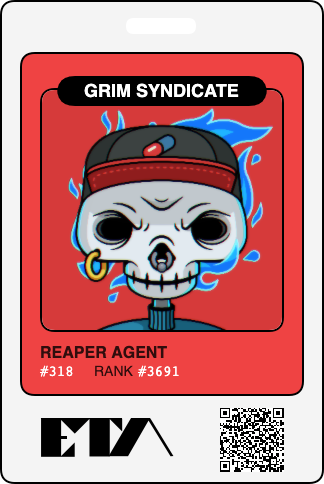

# A Grim Syndicate CLI

[](https://github.com/grahamplata/grim/actions/workflows/ci.yml)

> Standard issue Ethereal Transit Authority Toolbelt

A simple CLI tool to explore the [Grim Syndicate](https://grimsyndicate.com/) and Ethereal Transit Authority ecosystem.

---

- [A Grim Syndicate CLI](#a-grim-syndicate-cli)
  - [What’s The Grim Syndicate?](#whats-the-grim-syndicate)
    - [Links](#links)
  - [Todos](#todos)
  - [Prerequisites](#prerequisites)
  - [Install](#install)
  - [Usage](#usage)
    - [Help](#help)
    - [Fetch](#fetch)
    - [Community](#community)
  - [Personal Goals](#personal-goals)

---

## What’s The Grim Syndicate?

10,000 generative NFTs on the #Solana blockchain.

> The Grim Syndicate are an elite collective responsible for ferrying fickle Souls from across the dimensional spectrum (even those hard-to-reach pocket universes) to arrive at their final destination. At the Ethereal Transit Authority death doesn't have to mean a dead-end. -- https://grimsyndicate.com/

PS... Don't forget your [ID badge!](https://grimsyndicate.id/)



### Links

- [Website](https://grimsyndicate.com/)
- [Twitter](https://twitter.com/Grim__Syndicate)
- [Discord](https://discord.gg/xeHPSUhUv7)

## Todos

- Add external configuration ~ `$HOME/.config/grims`
- Commands
  - `community` - community info
    - `wallet` - get community wallet history
    - `holders` - count of distinct `'GRIM'` holders
  - `floor` - get the floor price of `'GRIM'` by `--filter` or `--all`
  - `watch` - follow market movement on supported platforms by `--filter` or `--all`
    - [magiceden.com](https://magiceden.io/)
    - [digitaleyes.market](digitaleyes.market/)
    - [solanart.io](https://solanart.io/)
    - [ftx.us](https://ftx.us/nfts)
    - [alpha.art](https://alpha.art/)
- Add support for upcoming [**Lurkers of the Abyss**](https://twitter.com/TheOtherSpy/status/1447420722456907776?s=20)
  - Daemons
  - 300 Doom Chalices

## Prerequisites

```bash
# Install Rust
# - https://www.rust-lang.org/tools/install
# - https://forge.rust-lang.org/infra/other-installation-methods.html

curl --proto '=https' --tlsv1.2 -sSf https://sh.rustup.rs | sh

# Solana on linux
# https://github.com/solana-labs/solana#1-install-rustc-cargo-and-rustfmt
sudo apt-get update
sudo apt-get install libssl-dev libudev-dev pkg-config zlib1g-dev llvm clang make
```

## Install

```bash
git clone https://github.com/grahamplata/sterling-pigeon.git
cd sterling-pigeon/grims
cargo run
# building
cargo build
cargo install --path .
grim
```

> To be able to run `grim`, you must be connected to the internet; you can read all content offline, however!

## Usage

Use this tool to query the **Ethereal Transit Authority** **(ETA)**.

### Help

```bash
eta help
eta 0.1.2

Graham Plata <graham.plata@gmail.com>

CLI tool to explore the Grim Syndicate and Ethereal Transit Authority ecosystem.

USAGE:
    eta [SUBCOMMAND]

FLAGS:
    -h, --help       Print help information
    -V, --version    Print version information

SUBCOMMANDS:
    community    fetch community info
    fetch        fetch token addresses
    floor        get the floor price
    help         Print this message or the help of the given subcommand(s)
    watch        follow market movement on supported platforms
```

### Fetch

```bash
eta fetch
Querying Program: metaqbxxUerdq28cj1RbAWkYQm3ybzjb6a8bt518x1s
Update Authority: Es1YghGkHZNJ8A9r6oFEHbWsRHbqs4rz6gfkRJ9V4bYf
Solana: https://api.mainnet-beta.solana.com

Found 10000 metadata_accounts

4dy7e5E2sDvqgF1GDbuMhcnJxF9iTFbH7JLebUXVmm9j
9yCuE87ZZr82V7gYWhfbkRPn1bnw82eZfhVxYcLSexRP
2uwD9VggndRrYfjoCN9iSMNJJMGtvkr1EA96As2zSrbA
9MZnGJfeDqJ8vDoEbWRRZKJzRxTBn6xUXZGtoTt5frve
7nRhZg1ecKFU5zzN9gbvRLvDwCFJKtpsXP2cmdjtdkHT
...
```

### Community

```bash
eta fetch community --wallet
SOL Balance ◎: 396.61271622500004
```

## Personal Goals

Learn and contribute to the 'GRIM' community.

- Community building
- Blockchain
- Solana
- Rust (first project)
- NFTs
